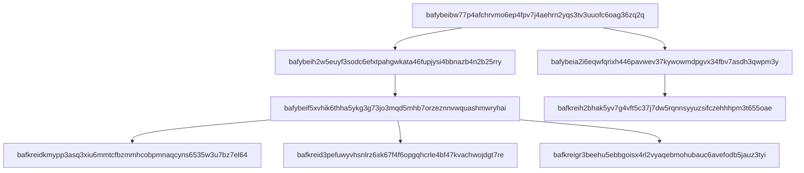

# linkdex

Creates an index mapping block CID to linked block CID for a CAR.

Origin story: https://gist.github.com/alanshaw/876aafba676b13890398500b96f82d8e

## Getting Stated

Install the deps
```console
npm install
```

pass it a car file, it writes the index in mermaid syntax to stdout  ✨🎷🐩

```console
npm start ~/Code/olizilla/cardex-cli/lols.car
```


