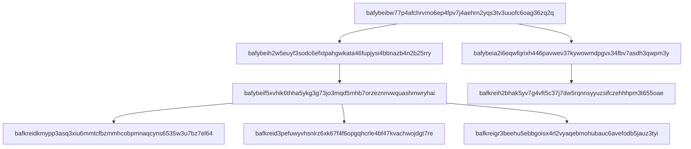

# linkdex

Creates an index mapping block CID to linked block CID for a CAR.

## Usage

Here is a quick demo of what the linkdex CLI can do.

```bash
# Print indexes to stdout
$ linkdex print thing-1.car thing-2.car
bafybeiaalbzxtx6jxr5znrtjtxvdn76s7zxl7e4rw6mvrbjz6gahhnc54y --> bafybeietimcnchtujzibl4vqyvrcosagvfandacatiees4zed6updxdssi
bafybeietimcnchtujzibl4vqyvrcosagvfandacatiees4zed6updxdssi --> bafkreic6ukg4v5hi7yt2qcebjpm2hkh34sejiiatr46wtiyntiwvlrskae
bafybeietimcnchtujzibl4vqyvrcosagvfandacatiees4zed6updxdssi --> bafkreiabfvaraoupn66wrdcgy3l2bb7vwfqha2y4u3owtqw5hc75uhneyq

# Writes indexes to file per CAR input
$ linkdex index thing-1.car thing-2.car
$ ls
thing-1.car thing-1.car.linkdex thing-2.car thing-2.car.linkdex

# Report the dag structure from the union of all the CARs
$ linkdex report thing-1.car thing-2.car
{"structure":"Complete","blockCount":21}

# Exit with error if any block links to a CID that is not in the set of blocks.
$ linkdex report thing-1.car --error-if-partial
{"structure":"Partial","blockCount":10}
Error: CAR(s) contain partial DAG
$ echo $? # 1
```

## Getting Stated

Install the deps
```console
npm install
```

pass it one or more car files, it writes the index in mermaid syntax to stdout  ✨🎷🐩

```console
linkdex print --mermaid lols.car
```



### Generating type declarations

Add good typescript flavour JSDoc comments to the JS source, then **validate** them and **generate** the `index.d.ts` declaration file:

```console
$ npm run tsc
```

This is done automatically via the `prepare` npm lifecycle hook.

see: https://www.typescriptlang.org/docs/handbook/declaration-files/dts-from-js.html
